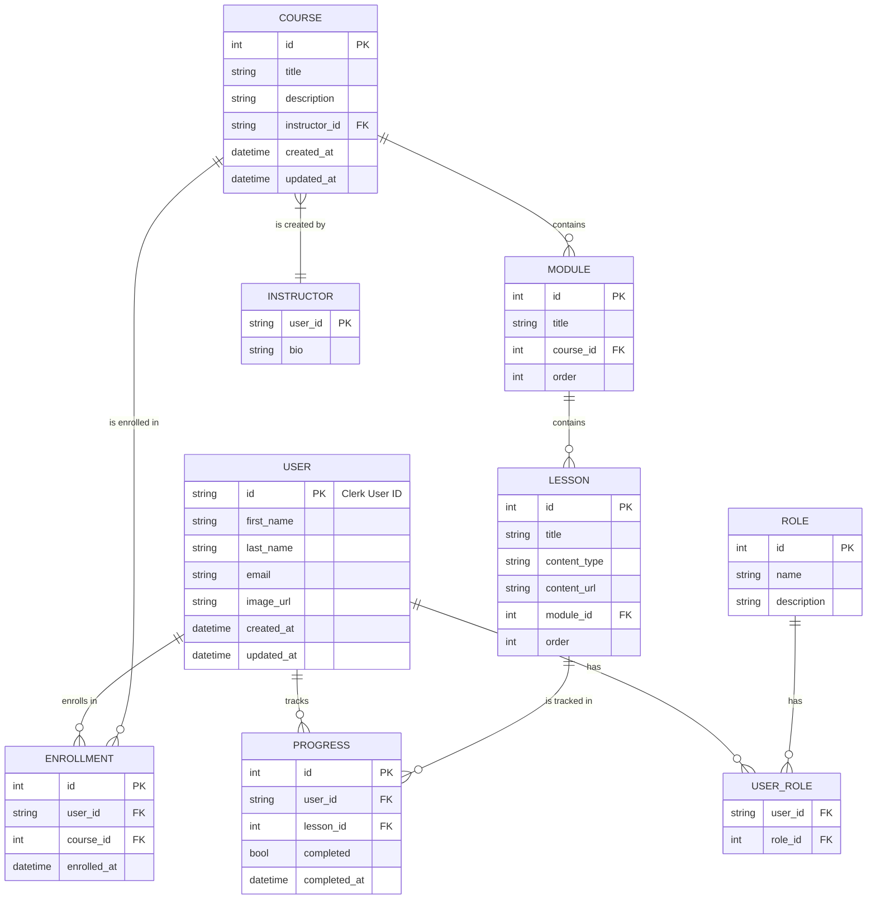

# Database Design: Learning Portal Platform

## 1. Database Design Summary
This document outlines the database schema for the Learning Portal Platform prototype. The design is optimized for a **Python/FastAPI backend using SQLModel with a SQLite database**, while also keeping in mind future compatibility with a Node.js/Prisma backend. The schema is normalized to reduce data redundancy and ensure data integrity, while being flexible enough to support the features outlined in the PRD, such as hierarchical course structures, role-based access control, and progress tracking.

## 2. Key Entities and Relationships
-   **User**: Represents a user of the platform. Linked to an external authentication provider (Clerk).
-   **Role**: Defines the user roles (e.g., Student, Instructor, Admin).
-   **UserRole**: A many-to-many link table between Users and Roles.
-   **Course**: The main entity for a course.
-   **Module**: A module within a course.
-   **Lesson**: A lesson within a module.
-   **Enrollment**: A many-to-many link table representing a user's enrollment in a course.
-   **Progress**: Tracks a user's completion status for a specific lesson.

## 3. ER Diagram


## 4. SQLModel Schema (Python/SQLite)
```python
from typing import List, Optional
from datetime import datetime
from sqlmodel import Field, Relationship, SQLModel

class UserRole(SQLModel, table=True):
    user_id: str = Field(foreign_key="user.id", primary_key=True)
    role_id: int = Field(foreign_key="role.id", primary_key=True)

class User(SQLModel, table=True):
    id: str = Field(default=None, primary_key=True) # Clerk User ID
    first_name: str
    last_name: str
    email: str = Field(unique=True)
    image_url: Optional[str] = None
    created_at: datetime = Field(default_factory=datetime.utcnow, nullable=False)
    updated_at: datetime = Field(default_factory=datetime.utcnow, nullable=False)

    roles: List["Role"] = Relationship(back_populates="users", link_model=UserRole)
    enrollments: List["Enrollment"] = Relationship(back_populates="user")
    progress: List["Progress"] = Relationship(back_populates="user")

class Role(SQLModel, table=True):
    id: Optional[int] = Field(default=None, primary_key=True)
    name: str = Field(unique=True)
    description: Optional[str] = None

    users: List[User] = Relationship(back_populates="roles", link_model=UserRole)

class Course(SQLModel, table=True):
    id: Optional[int] = Field(default=None, primary_key=True)
    title: str
    description: str
    instructor_id: str = Field(foreign_key="user.id")
    created_at: datetime = Field(default_factory=datetime.utcnow, nullable=False)
    updated_at: datetime = Field(default_factory=datetime.utcnow, nullable=False)

    modules: List["Module"] = Relationship(back_populates="course")
    enrollments: List["Enrollment"] = Relationship(back_populates="course")

class Module(SQLModel, table=True):
    id: Optional[int] = Field(default=None, primary_key=True)
    title: str
    order: int
    course_id: int = Field(foreign_key="course.id")

    course: Course = Relationship(back_populates="modules")
    lessons: List["Lesson"] = Relationship(back_populates="module")

class Lesson(SQLModel, table=True):
    id: Optional[int] = Field(default=None, primary_key=True)
    title: str
    content_type: str # e.g., 'video', 'text', 'quiz'
    content_url: Optional[str] = None
    order: int
    module_id: int = Field(foreign_key="module.id")

    module: Module = Relationship(back_populates="lessons")
    progress: List["Progress"] = Relationship(back_populates="lesson")

class Enrollment(SQLModel, table=True):
    id: Optional[int] = Field(default=None, primary_key=True)
    user_id: str = Field(foreign_key="user.id")
    course_id: int = Field(foreign_key="course.id")
    enrolled_at: datetime = Field(default_factory=datetime.utcnow, nullable=False)

    user: User = Relationship(back_populates="enrollments")
    course: Course = Relationship(back_populates="enrollments")

class Progress(SQLModel, table=True):
    id: Optional[int] = Field(default=None, primary_key=True)
    user_id: str = Field(foreign_key="user.id")
    lesson_id: int = Field(foreign_key="lesson.id")
    completed: bool = False
    completed_at: Optional[datetime] = None

    user: User = Relationship(back_populates="progress")
    lesson: Lesson = Relationship(back_populates="progress")
```

## 5. Prisma Schema (Node.js - Secondary)
```prisma
// This schema is for future compatibility with a Node.js backend.
// It mirrors the SQLModel schema.

model User {
  id          String      @id @default(cuid()) // Clerk User ID
  firstName   String
  lastName    String
  email       String      @unique
  imageUrl    String?
  createdAt   DateTime    @default(now())
  updatedAt   DateTime    @updatedAt
  roles       UserRole[]
  enrollments Enrollment[]
  progress    Progress[]
}

model Role {
  id          Int         @id @default(autoincrement())
  name        String      @unique
  description String?
  users       UserRole[]
}

model UserRole {
  user      User     @relation(fields: [userId], references: [id])
  userId    String
  role      Role     @relation(fields: [roleId], references: [id])
  roleId    Int

  @@id([userId, roleId])
}

model Course {
  id          Int         @id @default(autoincrement())
  title       String
  description String
  instructorId String
  createdAt   DateTime    @default(now())
  updatedAt   DateTime    @updatedAt
  modules     Module[]
  enrollments Enrollment[]
}

model Module {
  id        Int      @id @default(autoincrement())
  title     String
  order     Int
  course    Course   @relation(fields: [courseId], references: [id])
  courseId  Int
  lessons   Lesson[]
}

model Lesson {
  id          Int        @id @default(autoincrement())
  title       String
  contentType String
  contentUrl  String?
  order       Int
  module      Module     @relation(fields: [moduleId], references: [id])
  moduleId    Int
  progress    Progress[]
}

model Enrollment {
  id         Int      @id @default(autoincrement())
  user       User     @relation(fields: [userId], references: [id])
  userId     String
  course     Course   @relation(fields: [courseId], references: [id])
  courseId   Int
  enrolledAt DateTime @default(now())
}

model Progress {
  id           Int       @id @default(autoincrement())
  user         User      @relation(fields: [userId], references: [id])
  userId       String
  lesson       Lesson    @relation(fields: [lessonId], references: [id])
  lessonId     Int
  completed    Boolean   @default(false)
  completedAt  DateTime?
}
```

## 6. Design Rationale & Assumptions
-   **User ID**: The `User.id` is a `string` to accommodate Clerk's user IDs. This is the primary key and is used as a foreign key in other tables.
-   **Roles and Permissions**: A many-to-many relationship between `User` and `Role` is implemented to allow for flexible role assignments.
-   **Course Structure**: The `Course` -> `Module` -> `Lesson` hierarchy is implemented with one-to-many relationships. The `order` field in `Module` and `Lesson` allows for custom ordering.
-   **Progress Tracking**: The `Progress` table tracks completion on a per-lesson basis for each user. This allows for granular tracking of a user's journey through a course.
-   **Indexing**: For the SQLite prototype, primary keys are automatically indexed. For a production environment, additional indexes would be added to foreign keys (e.g., `Progress.user_id`, `Progress.lesson_id`) to optimize query performance.
-   **Future Scaling**: This normalized schema is well-suited for migration to a more robust database like PostgreSQL. The Prisma schema is provided to facilitate this transition.
